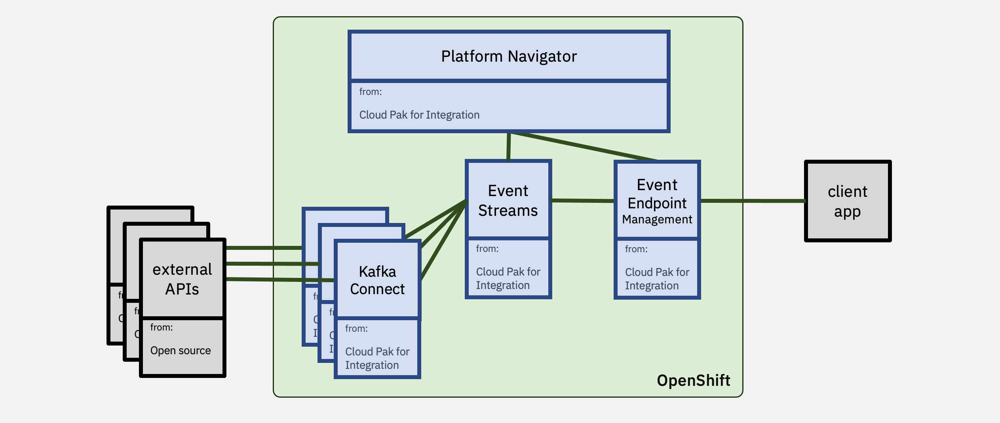

# Event Endpoint Management demo



**This repository contains automation to build and run an Event Endpoint Management demo.**

* Configures and deploys a Kafka cluster
* Creates multiple Kafka topics
* Builds and runs a custom Kafka Connect cluster to push streams of events to Kafka topics from various sources
* Creates an Event Endpoint Management instance
* Generates documentation for the Kafka topics and publishes to an Event Endpoint Management developer portal
* Configures the Event Gateway to allow managed access to the Kafka topics
* Deploys the CP4I Platform Navigator to manage all of these components

Once complete, the automation will output:
- Details (URL, username, password) for accessing the CP4I Platform Navigator
- Details (URL, username, password) for accessing the Event Streams admin UI
- Details (URL, username, password) for accessing the EEM Developer Portal

More details, with video recordings of using it, at:
https://dalelane.github.io/event-endpoint-management-demo/

## Instructions:

The automation in this repo will deploy the stack described above to an existing Red Hat OpenShift cluster.

To deploy the demo:

### 1. oc login (as admin)
```
oc login ...
```

### 2. create YAML files for three secrets based on templates
- `github-credentials.yaml`
    - based on [`template-github-credentials.yaml`](./template-github-credentials.yaml) - github personal access token with access to clone this repo - which should be created in the namespace where the pipelines will run
- `ibm-entitlement-key.yaml`
    - based on [`template-ibm-entitlement-key.yaml`](./template-ibm-entitlement-key.yaml) - secret with an [IBM Entitlement Key](https://www.ibm.com/docs/en/cloud-paks/cp-integration/2021.3?topic=installing-applying-your-entitlement-key) for access to Cloud Pak for Integration software - which should be created in the `pipeline-credentials` namespace
- `alphavantage-apikey.yaml`
    - based on [`template-alphavantage-apikey.yaml`](./template-alphavantage-apikey.yaml) - secret with an [API key from AlphaVantage](https://www.alphavantage.co/support/#api-key) - which should be created in the `pipeline-credentials` namespace
- `twitter-apikey.yaml`
    - based on [`template-twitter-apikey.yaml`](./template-twitter-apikey.yaml) - secret with an [API key from Twitter](https://developer.twitter.com) - which should be created in the `pipeline-credentials` namespace


### 3. start deployment
```
make all
```

(if you want to tail detailed logs to see what is happening, the [`tkn` CLI](https://github.com/tektoncd/cli) is good: ` tkn pipelinerun logs -f `)


---

## Makefile info

There are many other targets in the Makefile for more granular deployment options.

### create and run pipelines

run the make command (see below) while logged in (with admin privileges) to an OpenShift cluster using `oc`

| **command**                             | **what it does**                                                         |
| ----------------------------------      | ------------------------------------------------------------------------ |
| `make all`                              | deploys the whole demo (does all of the below in order)                  |
|                                         |                                                                          |
| `make pipeline_ibmcatalog`              | adds the IBM Catalog to the OpenShift Operators marketplace              |
| `make pipeline_platformnavigator`       | creates an instance of CP4I Platform Navigator                           |
| `make pipeline_eventstreams`            | creates an Event Streams Kafka cluster and an Apicurio schema registry   |
| `make pipeline_kafkaconnectors`         | creates connectors that generate multiple streams of events              |
| `make pipeline_eventendpointmanagement` | creates and sets up an instance of Event Endpoint Management             |
| `make pipeline_stockpricesasyncapi`     | generates and publishes API documentation for the connectors             |

### remove pipeline resources

| **command**                                     | **what it does**                                                        |
| ----------------------------------              | ----------------------------------------------------------------------- |
| `make clean`                                    | removes all pipeline resources -all of the below and additional cleanup |
|                                                 |                                                                         |
| `make cleanup_pipeline_ibmcatalog`              | removes pipeline resources used to add the IBM Catalog                  |
| `make cleanup_pipeline_platformnavigator`       | removes pipeline resources used to create CP4I Platform Navigator       |
| `make cleanup_pipeline_eventstreams`            | removes pipeline resources used to create Event Streams                 |
| `make cleanup_pipeline_kafkaconnectors`         | removes pipeline resources used to build connectors                     |
| `make cleanup_pipeline_eventendpointmanagement` | removes pipeline resources used to create Event Endpoint Management     |
| `make cleanup_pipeline_stockpricesasyncapi`     | removes pipeline resources used to generate and publishes API docs      |

